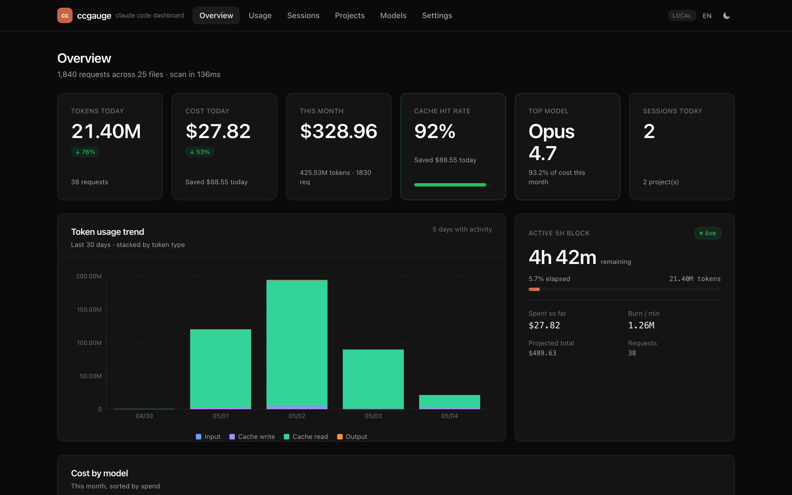

<div align="center">

# ccgauge

Local web dashboard for your Claude Code token usage and cost. Zero-config.

[](https://www.npmjs.com/package/ccgauge)
[](./LICENSE)
[](#)

[English](./README.md) · [简体中文](./README.zh-CN.md)

</div>

```bash
npx ccgauge
```

That's it. ccgauge scans `~/.claude/projects/` (and `~/.config/claude/projects/`), reads the JSONL files, computes token usage + USD cost + cache savings, and opens a dashboard in your browser. **Data never leaves your machine.**



---

## Why

[ccusage](https://github.com/ryoppippi/ccusage) (the de-facto standard) is a great terminal CLI but it's a wall of numbers. ccgauge gives you the same data with charts, drill-down by project / session / model, a live 5-hour-block countdown, and a clear **"saved by cache"** KPI — all in a polished local web UI. Bilingual (English + 中文), light + dark themes, completely offline.

## Features

- **Overview** — KPI cards: tokens today, cost today, this month, cache hit rate, top model, sessions today
- **Live 5h block** — countdown + progress + burn rate + projected total cost
- **Token usage trend** — stacked bar chart broken down by `input` / `output` / `cache_read` / `cache_creation`
- **Sessions** — per-conversation list with model / tokens / cost / duration; click into the message-level timeline
- **Projects** — per-`cwd` aggregation cards with sparkline + spend share
- **Models** — side-by-side comparison: cost share, tokens share, cache hit rate, USD pricing
- **Cache savings** — separate KPI showing how much cache reads have saved you vs. paying full input price
- **i18n** — English / 中文, persisted to localStorage + cookie (no flash on initial paint)
- **Themes** — Light / Dark / System (no flash, follows `prefers-color-scheme` when set to System)
- **Filters** — time range (today / 7d / 30d / 90d / all), granularity (hour / day / week / month), model multi-select, project multi-select
- **Export** — CSV download of the request log
- **100% local** — read-only access to JSONL files, no telemetry, no network calls

## Install / Run

```bash
# zero-install one-shot (recommended)
npx ccgauge

# global install
npm  i -g ccgauge     && ccgauge
pnpm i -g ccgauge     && ccgauge
yarn global add ccgauge && ccgauge

# dlx
pnpm dlx ccgauge
```

### Options

```
ccgauge [options]

  -p, --port <port>     preferred port (default: 3737)
  -h, --host <host>     bind host (default: 127.0.0.1)
      --no-open         do not auto-open the browser
      --dir <path>      override Claude config dir (will append /projects)
  -q, --quiet           silence Next.js output
  -V, --version         output version
      --help            show help
```

If `3737` is taken ccgauge falls back to the next available port automatically.

### Environment variables

| Variable              | Effect                                                              |
| --------------------- | ------------------------------------------------------------------- |
| `CCGAUGE_CONFIG_DIR`  | Use `<dir>/projects` as a data source (in addition to defaults)     |
| `CLAUDE_CONFIG_DIR`   | Same as above (compatible with Claude Code 1.0.30+)                 |

## Develop

This repo is also a working Next.js project — you can run the dashboard against your live data while iterating on the code.

```bash
git clone https://github.com/chengzuopeng/ccgauge.git
cd ccgauge
pnpm install
pnpm dev               # http://localhost:3737
```

Other handy scripts:

```bash
pnpm typecheck         # tsc --noEmit
pnpm lint              # next lint
pnpm build             # next build + copy static into .next/standalone
pnpm start             # run bin/cli.mjs against the standalone build
pnpm screenshots       # regenerate docs/screenshots/*.png (requires Chromium)
pnpm clean             # rm -rf .next node_modules tsconfig.tsbuildinfo
```

To produce the npm-publishable artifact:

```bash
pnpm build
node bin/cli.mjs       # exact same entrypoint as `npx ccgauge`
```

To preview what would be published:

```bash
pnpm pack              # writes ccgauge-<version>.tgz; tar -tzf to inspect
```

## Publish

```bash
# bump version in package.json, then:
pnpm publish --access public
```

`prepublishOnly` runs `pnpm build` first, so the `.next/standalone` artifact is always fresh.

## How it works

1. **CLI** (`bin/cli.mjs`) picks an available port via [`get-port`](https://github.com/sindresorhus/get-port), then `fork()`s the Next.js standalone server (`.next/standalone/server.js`).
2. Once the server responds, it [`open()`](https://github.com/sindresorhus/open)s the browser to that URL.
3. The Next.js server-side code in `lib/data-loader/scan.ts` reads `~/.claude/projects/**/*.jsonl`, parses every `assistant` message, dedups via `(message.id, requestId)`, and aggregates by day / model / project / session / 5h-block.
4. Pricing is from a built-in snapshot of Anthropic's published rates (12 models). Unknown models fall back to the same family's latest rate.
5. i18n + theme: cookie-driven SSR + `localStorage` mirror + an inline no-flash script in `<head>`.

## License

MIT — see [LICENSE](./LICENSE).
