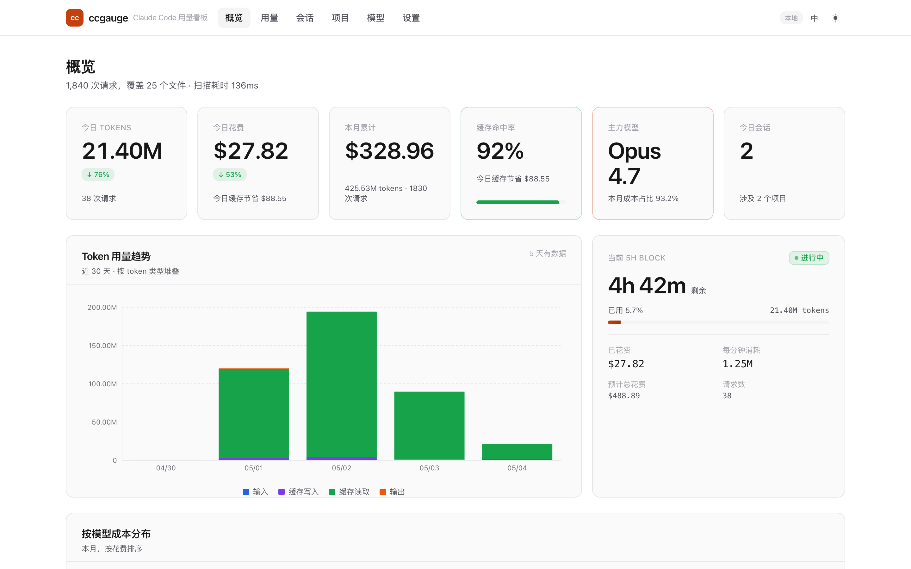
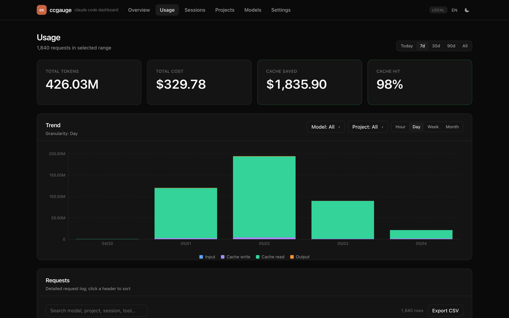
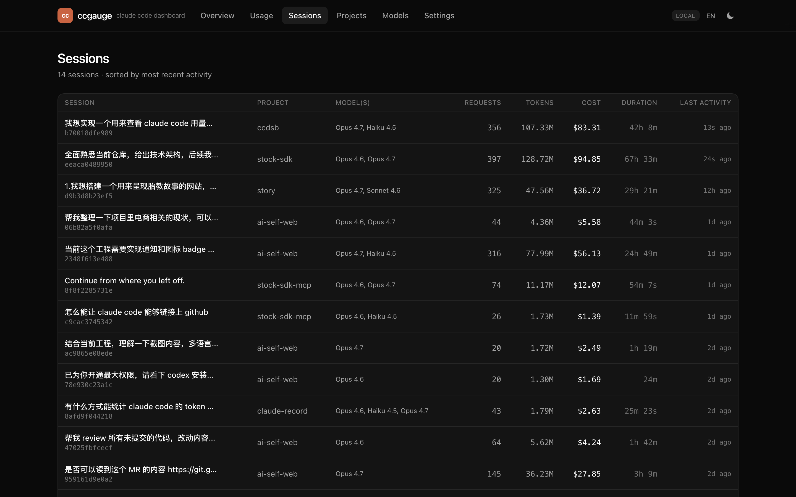
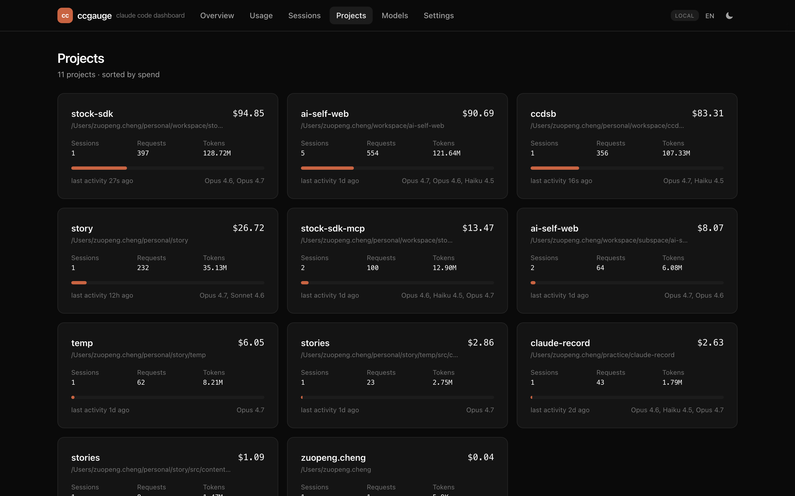
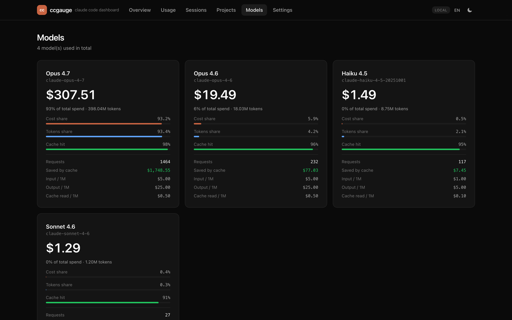
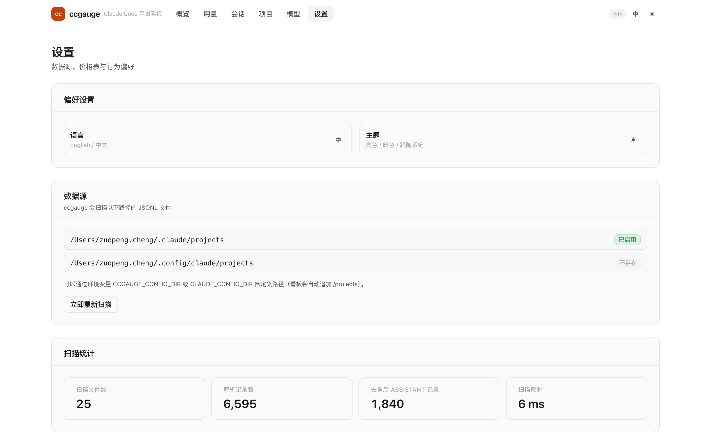

<div align="center">

# ccgauge

Claude Code 用量本地看板，零配置开箱即用。

[](https://www.npmjs.com/package/ccgauge)
[](./LICENSE)
[](#)

[English](./README.md) · [简体中文](./README.zh-CN.md)

</div>

```bash
npx ccgauge
```

就这一行。ccgauge 会扫描 `~/.claude/projects/`（以及 `~/.config/claude/projects/`）下的 JSONL 文件，计算 token 用量、美元成本与缓存节省，然后在浏览器里打开看板。**所有数据全程不离开你的电脑。**



---

## 为什么写这个

社区已有的 [ccusage](https://github.com/ryoppippi/ccusage) 是终端 CLI 标杆，但它给你的是一墙的数字。ccgauge 用同一份数据画出图表、按项目 / 会话 / 模型分维度下钻、5 小时 block 实时倒计时，还把"缓存节省了多少钱"单独做成一张 KPI 卡 —— 全部塞进一个本地的现代 Web 看板。中英双语、亮暗双主题、完全离线。

## 功能

- **概览** —— 6 张 KPI 卡：今日 tokens、今日花费、本月累计、缓存命中率、主力模型、今日会话
- **5h block 实时倒计时** —— 进度条 + 每分钟消耗速度 + 预计总花费
- **Token 趋势** —— 堆叠柱状图，按 4 类 token（输入 / 输出 / 缓存读 / 缓存写）拆分
- **会话** —— 每场对话单独成行，含模型 / tokens / 花费 / 时长；点进去看消息级时间线
- **项目** —— 按工作目录 (`cwd`) 聚合的卡片网格，含趋势条与花费占比
- **模型** —— 各模型并排对比：成本占比、token 占比、缓存命中、官方单价
- **缓存节省** —— 单独一张 KPI 卡告诉你"如果不用 cache，今天会多花多少钱"
- **国际化** —— English / 中文 双语，cookie + localStorage 双向同步，刷新无文字闪烁
- **主题** —— 亮色 / 暗色 / 跟随系统三档，首屏无闪烁
- **筛选** —— 时间区间（今天 / 7 天 / 30 天 / 90 天 / 全部）、粒度（小时 / 天 / 周 / 月）、模型 multi-select、项目 multi-select
- **导出** —— 请求列表一键导出 CSV
- **100% 本地** —— 只读访问 JSONL，零遥测，零网络调用

## 截图

### 概览 —— English · Dark


### 概览 —— 中文 · Light


### 用量 —— 筛选、堆叠趋势、请求明细



### 会话 —— 每场对话，按最近活跃排序



### 项目 —— 按 `cwd` 聚合的花费卡片



### 模型 —— 成本 / 缓存 / 单价并排对比



### 设置 —— 语言 / 主题 / 数据源 / 价格表



## 安装 / 运行

```bash
# 一行运行（推荐）
npx ccgauge

# 全局安装后直接用
npm  i -g ccgauge     && ccgauge
pnpm i -g ccgauge     && ccgauge
yarn global add ccgauge && ccgauge

# pnpm dlx
pnpm dlx ccgauge
```

### 命令行选项

```
ccgauge [options]

  -p, --port <port>     首选端口（默认 3737）
  -h, --host <host>     绑定地址（默认 127.0.0.1）
      --no-open         不自动开浏览器
      --dir <path>      自定义 Claude 配置目录（会自动追加 /projects）
  -q, --quiet           静默 Next.js 输出
  -V, --version         查看版本
      --help            查看帮助
```

如果 `3737` 被占用，ccgauge 会自动顺延到下一个可用端口。

### 环境变量

| 变量                 | 作用                                                                |
| -------------------- | ------------------------------------------------------------------- |
| `CCGAUGE_CONFIG_DIR` | 把 `<dir>/projects` 也加入扫描路径（在默认路径之外）                  |
| `CLAUDE_CONFIG_DIR`  | 同上（与 Claude Code 1.0.30+ 兼容）                                 |

## 本地开发

这个仓库本身就是一个能跑的 Next.js 工程，可以一边改代码一边看实时数据。

```bash
git clone https://github.com/chengzuopeng/ccgauge.git
cd ccgauge
pnpm install
pnpm dev               # http://localhost:3737
```

常用脚本：

```bash
pnpm typecheck         # tsc --noEmit
pnpm lint              # next lint
pnpm build             # next build + 把 static 拷进 .next/standalone
pnpm start             # 用 bin/cli.mjs 跑 standalone 产物
pnpm screenshots       # 重新生成 docs/screenshots/*.png（需要 Chromium）
pnpm clean             # rm -rf .next node_modules tsconfig.tsbuildinfo
```

打出 npm 可发布的产物：

```bash
pnpm build
node bin/cli.mjs       # 入口与 npx ccgauge 完全一致
```

预览将要发布的内容：

```bash
pnpm pack              # 生成 ccgauge-<version>.tgz；用 tar -tzf 查看
```

## 发布

```bash
# 先在 package.json 里 bump version，然后：
pnpm publish --access public
```

`prepublishOnly` 会自动跑 `pnpm build`，所以 `.next/standalone` 总是新鲜的。

## 工作原理

1. **CLI**（`bin/cli.mjs`）通过 [`get-port`](https://github.com/sindresorhus/get-port) 找到一个可用端口，然后 `fork()` Next.js 的 standalone server (`.next/standalone/server.js`)。
2. 服务起来之后，用 [`open`](https://github.com/sindresorhus/open) 把浏览器开到对应 URL。
3. Next.js 的服务端代码 `lib/data-loader/scan.ts` 扫描 `~/.claude/projects/**/*.jsonl`，解析每一条 `assistant` 消息，按 `(message.id, requestId)` 去重，然后按 天 / 模型 / 项目 / 会话 / 5h-block 多维聚合。
4. 单价用内置的 Anthropic 官价快照（12 个模型）；遇到未知模型时，回退到同 family 的最新一档单价。
5. i18n + 主题：cookie 驱动 SSR + `localStorage` 镜像 + `<head>` 注入一段同步执行的 no-flash 脚本。

## 许可证

MIT —— 详见 [LICENSE](./LICENSE)。
